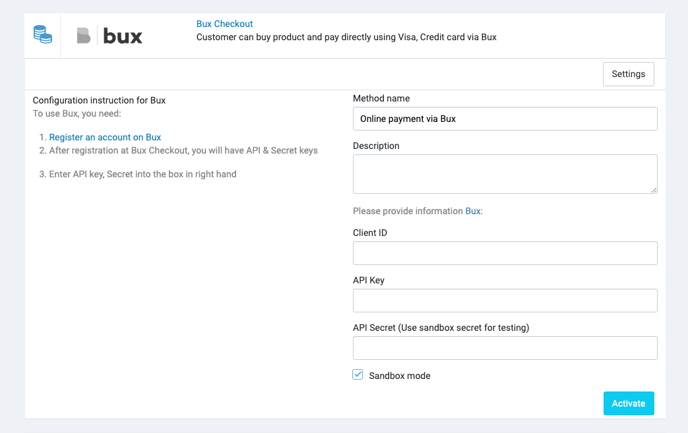

# Bux

[Bux](https://www.bux.com/) is a payment gateway that allows you to send and receive payments through multiple payment
methods like e-wallets, installments and more with Bux, the Philippines' leading payment gateway.

## Setup

### 1. Create a Bux account

Create a Bux account at https://www.bux.com/.

Then please proceed to the **Integration** or **Link Stores** tab of your dashboard to view the following information:

- Client ID
- API Key
- API Secret (Use sandbox secret for testing)

### 2. Configure Bux in Admin

In your store's Admin, go to **Payments** -> **Payment Methods**, click to **Settings** of the Bux payment method,
and it will open the configuration section.

