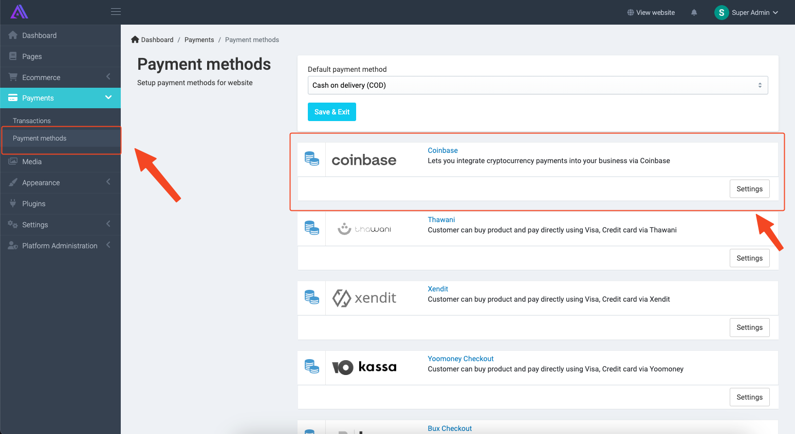
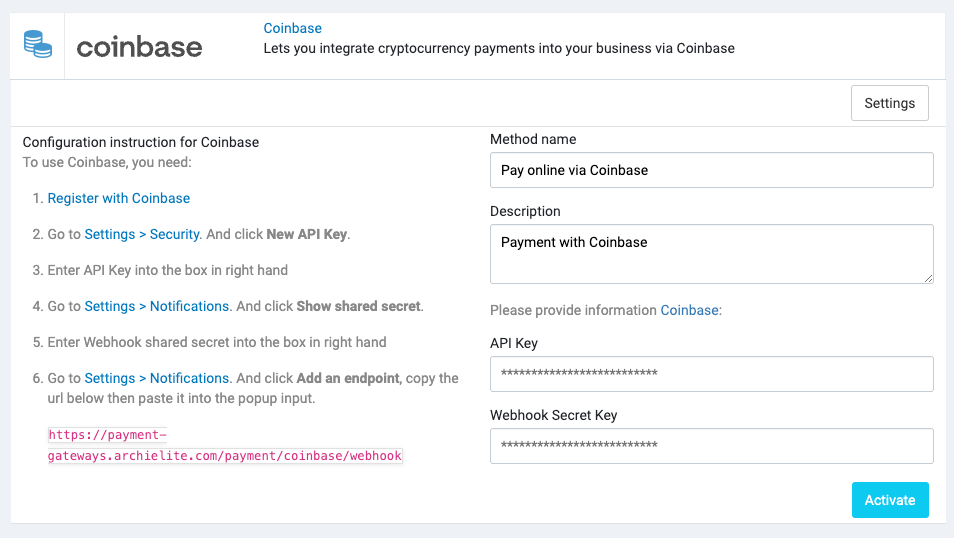

# Coinbase

[Coinbase](https://coinbase.com) is a secure online platform for buying, selling, transferring, and storing
cryptocurrency.

## Setup

### 1. Create a Coinbase account

[Sign up](https://www.coinbase.com/signup) for a Coinbase account. You can
also [sign in](https://www.coinbase.com/signin) if you already have one.

### 2. Create an API key

Create an API key in your [Coinbase API settings](https://www.coinbase.com/settings/api).

### 3. Configure Coinbase in Admin

In your store's Admin, go to **Payments** -> **Payment Methods**, click to **Settings** of the Coinbase payment method,
and it will open the configuration section.

Enter the API key and Webhook secret you created in step 2 and click **Activate** to enable the payment method.

## Supported currencies

Visit https://www.coinbase.com/browse to see the list of supported currencies.
