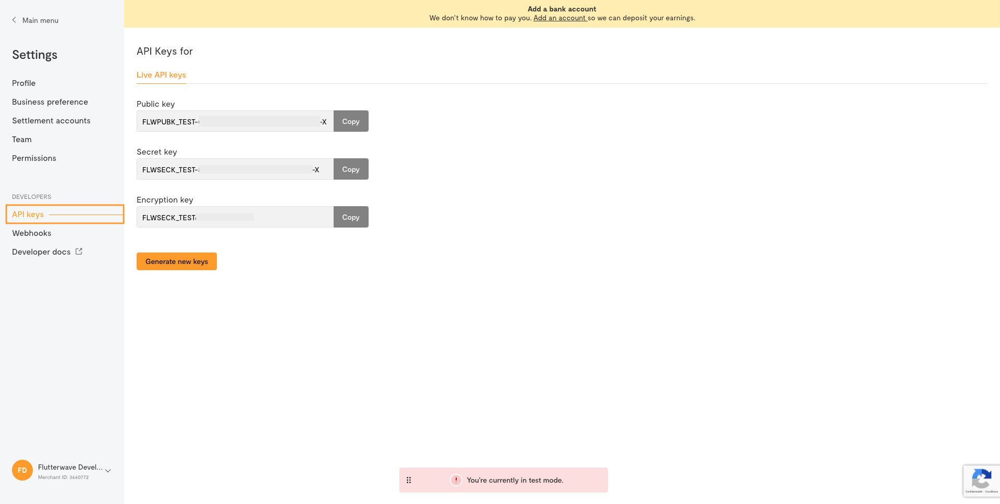
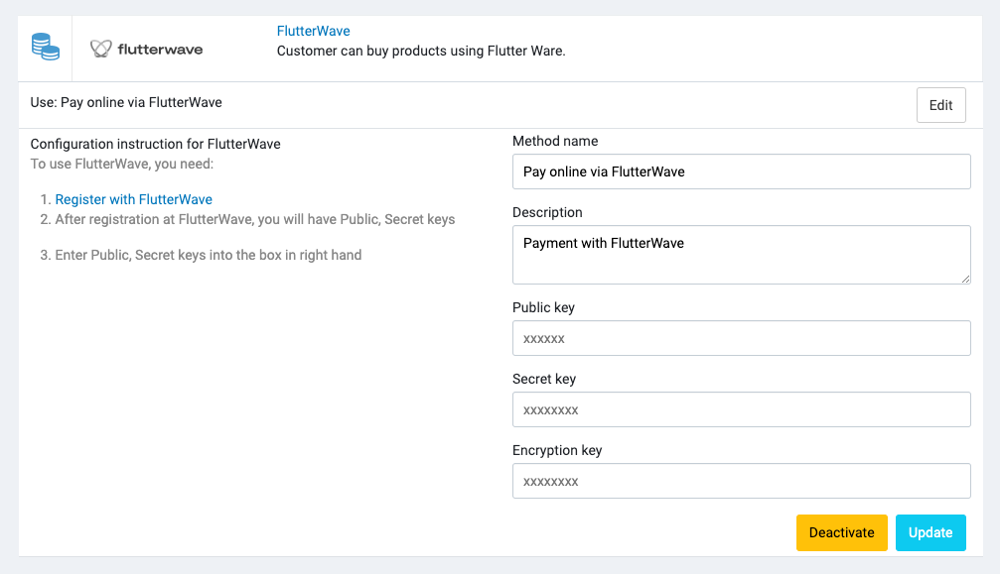

# Flutterwave

With [Flutterwave](https://flutterwave.com/), you can make and receive payments in dozens of currencies and countries,
with a variety of payment channels.

## Setup

### Step 1: Create a Flutterwave account

Start by creating an account on https://app.flutterwave.com/register.

When you create a Flutterwave account, you're given three kinds of API keys:

- **Secret key**
- **Public key**
- **Encryption key**

To get your keys:

- Log in to your [Flutterwave dashboard](https://dashboard.flutterwave.com).
- Navigate to **Settings**
- Select the **API Keys** open in the Developers section of the menu to view and copy your keys.

You can read more about Flutterwave's API
credentials [here](https://developer.flutterwave.com/docs/integration-guides/authentication).

### Step 2: Configure Flutterwave in Admin

In the Admin, navigate to **Settings** -> **Payment** -> **Payment Methods**, click to **Settings** of the Flutterwave
payment method, and it will open the configuration section.

## Supported currencies

| CURRENCY NAME                | CURRENCY CODE |
|------------------------------|---------------|
| British Pound Sterling       | GBP           |
| Canadian Dollar              | CAD           |
| Central African CFA Franc    | XAF           |
| Chilean Peso                 | CLP           |
| Colombian Peso               | COP           |
| Egyptian Pound               | EGP           |
| SEPA                         | EUR           |
| Ghanaian Cedi                | GHS           |
| Guinean Franc                | GNF           |
| Kenyan Shilling              | KES           |
| Malawian Kwacha              | MWK           |
| Moroccan Dirham              | MAD           |
| Nigerian Naira               | NGN           |
| Rwandan Franc                | RWF           |
| Sierra Leonean Leone         | SLL           |
| São Tomé and Príncipe dobra  | STD           |
| South African Rand           | ZAR           |
| Tanzanian Shilling           | TZS           |
| Ugandan Shilling             | UGX           |
| United States Dollar         | USD           |
| West African CFA Franc BCEAO | XOF           |
| Zambian Kwacha               | ZMW           |

[What are the currencies accepted on Flutterwave?](https://flutterwave.com/za/support/general/what-are-the-currencies-accepted-on-flutterwave)

## Test Cards

| Bank | Account Number | OTP |
|------|----------------|-----|
| Access Bank (044) | 0690000031 | 12345 |
| Access Bank (044) | 0690000032 | 12345 |
| Access Bank (044) | 0690000033 | 12345 |
| Access Bank (044) | 0690000034 | 12345 |

Read more about test cards [here](https://developer.flutterwave.com/docs/integration-guides/testing-helpers/).