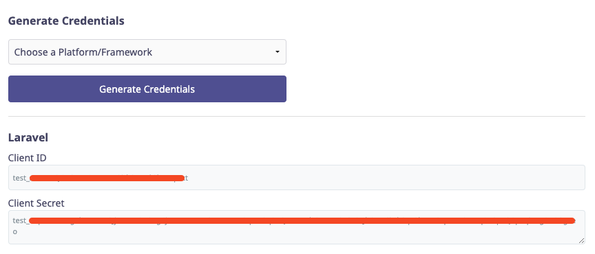
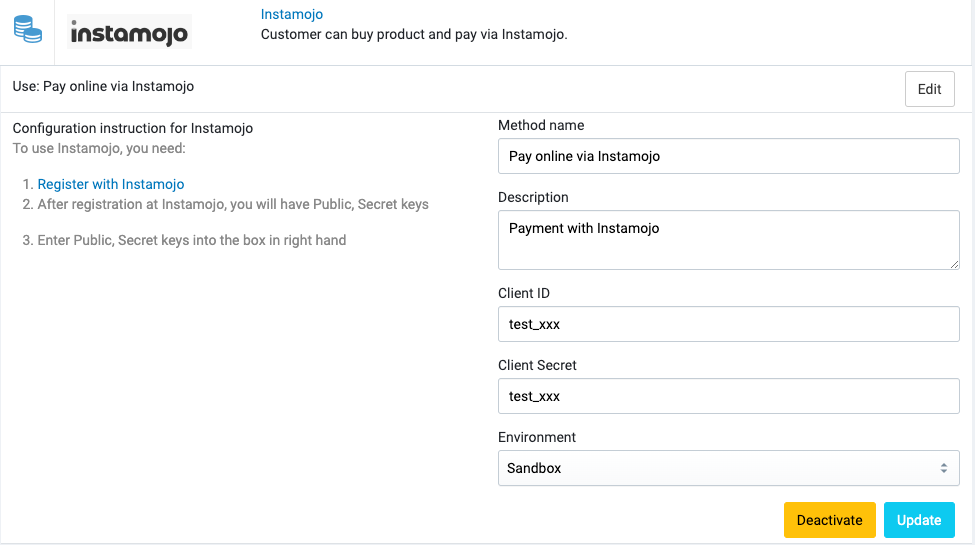

# Instamojo

[Instamojo](https://www.instamojo.com/) is a powerful payment gateway features to help you grow your business online for
India.

## Setup

To set up Instamojo integration you will need to have an account with Instamojo. You can create an account
at https://www.instamojo.com/accounts/register/.

Once you have an account, you will need to create an API key. You can do this by going to the **API & Plugins** section,
scroll down to the Generate Credentials section and generate a new credential.

## Configuration in Admin

In your store's Admin, go to **Payments** -> **Payment Methods**, click to **Settings** of the Instamojo payment method,
and it will open the configuration section.

## Test Cards

| Type       | Card Number         | Expiry Date | CVV | OTP    |
|------------|---------------------|-------------|-----|--------|
| Mastercard | 5214 4789 0000 5330 | 01/2025     | 123 | 111111 |
| Visacard   | 4065 6200 0000 1239 | 01/2025     | 123 | 111111 |

## Supported currencies

Instamojo only supports INR currency.

Read more https://support.instamojo.com/hc/en-us/articles/209547805-Currencies-supported-by-Instamojo.