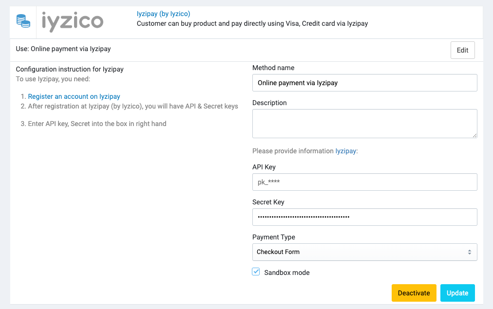

# Iyzipay

[Iyzipay](https://iyzico.com) is an Iyzico product to modernize credit card payments, make the credit card payments
mechanisms easy for the
individuals and companies. Iyzipay supports amex, dinersclub, discover, jcb, maestro, mastercard, visa, troy and visa
electron types

## Setup

You can sign up for an iyzico account at https://iyzico.com

## Configuration in Admin

Go to **Admin** -> **Settings** -> **Payment methods** -> **Iyzipay** to configure the payment method.

## How to test

Go to https://sandbox-merchant.iyzipay.com and create an account. Copy the credentials generated via their dashboard and
then put the information as described above.

### Test Cards

Here are some test cards you can use to test the payment gateway.

| Card Number	     | Bank	      | Card type            |
|------------------|------------|----------------------|
| 5890040000000016 | Akbank     | Master Card (Debit)  |
| 5526080000000006 | Akbank     | Master Card (Credit) |
| 4766620000000001 | Denizbank  | Visa (Debit)         |
| 4603450000000000 | Denizbank  | Visa (Credit)        |
| 4987490000000002 | Finansbank | Visa (Debit)         |
| 5311570000000005 | Finansbank | Master Card (Credit) |

You can find more test cards at https://dev.iyzipay.com/en/test-kartlari

## Video tutorial

<iframe width="560" height="315" src="https://www.youtube.com/embed/0X0ohSWMlis" title="YouTube video player" frameborder="0" allow="accelerometer; autoplay; clipboard-write; encrypted-media; gyroscope; picture-in-picture; web-share" allowfullscreen></iframe>
