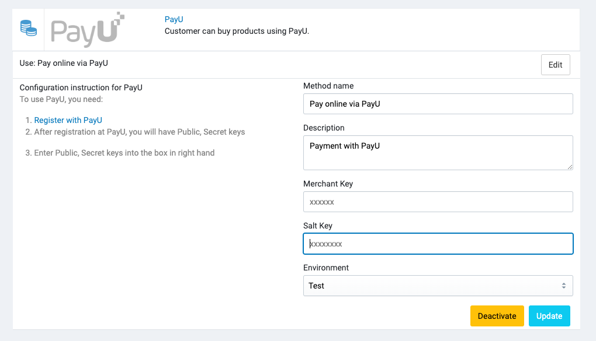

# PayU

With [PayU](https://payu.in), you can accept online payments from across all channels and devices, through a single
processing platform.
You can collect payments on any website, mobile app, tablet or using any social app. While there are many channels of
payment acceptance, all your transactions reconcile in one easy-to-use location - the PayU payment gateway.

## Setup

To create a test merchant account, refer
to [Register for a Test Merchant Account](https://devguide.payu.in/low-code-web-sdk/getting-started-low-code-web-sdk/register-for-a-test-merchant-account/).
After you create a test merchant account, you can access the test Key or Salt as described
in [Generate Test Merchant Key and Salt](https://devguide.payu.in/low-code-web-sdk/getting-started-low-code-web-sdk/generate-test-merchant-key-and-salt/).

## Configure Coinbase in Admin

In your store's Admin, go to **Payments** -> **Payment Methods**, click to **Settings** of the PayU payment method,
and it will open the configuration section.

## Supported currencies

Currency conversion is possible from PLN and CZK:

| Term currency | Base currency |
|---------------|---------------|
| CZK           | EUR           |
| CZK	          | GBP           |
| CZK	          | USD           |
| PLN	          | DKK           |
| PLN	          | EUR           |
| PLN	          | GBP           |
| PLN	          | NOK           |
| PLN	          | SEK           |
| PLN	          | USD           |

**Term currency (final currency – shop currency)** - currency in which the recipient will receive payment (currency of
the shop in the PayU system).

**Base currency (initial currency – payer currency)** - currency in which payer will be charged for payment (card
settlement currency).

## Test Cards

| Payment Flow                  | Card Number         | Brand      | Expiry          | CVV | OTP    | Name     |
|-------------------------------|---------------------|------------|-----------------|-----|--------|----------|
| PayU/Merchant Hosted Checkout | 5123-4567-8901-2346 | Mastercard | any future date | 123 | 123456 | any name |
| PayU/Merchant Hosted Checkout | 4012-0010-3714-1112 | VISA       | any future date | 123 | 123456 | any name |
| Server-to-Server              | 5497-7744-1517-0603 | Mastercard | any future date | 412 | 123456 | any name |
