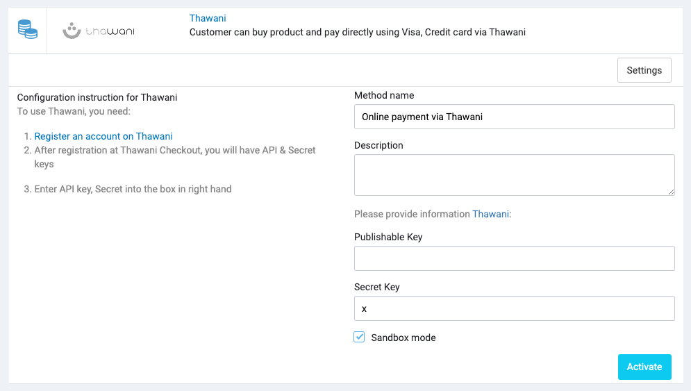

# Thawani

[Thawani Pay](https://thawani.om/about) is a Payment Gateway that solves this problem.
The [Thawani Checkout](https://thawani.om/checkout) API, allows for transactions to be made using OMR.

## Setup

Create a Thawani account at [Thawani](https://merchant.thawani.om).

After creating an account, you will be able to create your API keys from the [Thawani Setting](https://merchant.thawani.om/admin/Setting).

## 3. Configure Thawani in Admin

In your store's Admin, go to **Payments** -> **Payment Methods**, click to **Settings** of the Thawani payment method.

Please enter Secret API Key and Publishable Key from the account created in Thawani.

## Video tutorial

<iframe width="560" height="315" src="https://www.youtube.com/embed/yKWHAWXw8zg" title="YouTube video player" frameborder="0" allow="accelerometer; autoplay; clipboard-write; encrypted-media; gyroscope; picture-in-picture; web-share" allowfullscreen></iframe>

## Test Card

Below cards can be used to get different responses. Expiration Date must be a valid date in the future (use the mm/yy format). Any CVV/CVC is accepted

|CARD NUMBER|DESCRIPTION|
|-----------|-----------|
|4242 4242 4242 4242|Always accept.|
|4000 0000 0000 0002|Always reject.|
|4456 5300 0000 1096|To test 3D Secure (Credit Card). Always accept.|
|4456 5300 0000 1104|To test 3D Secure (Credit Card). Always reject.|
