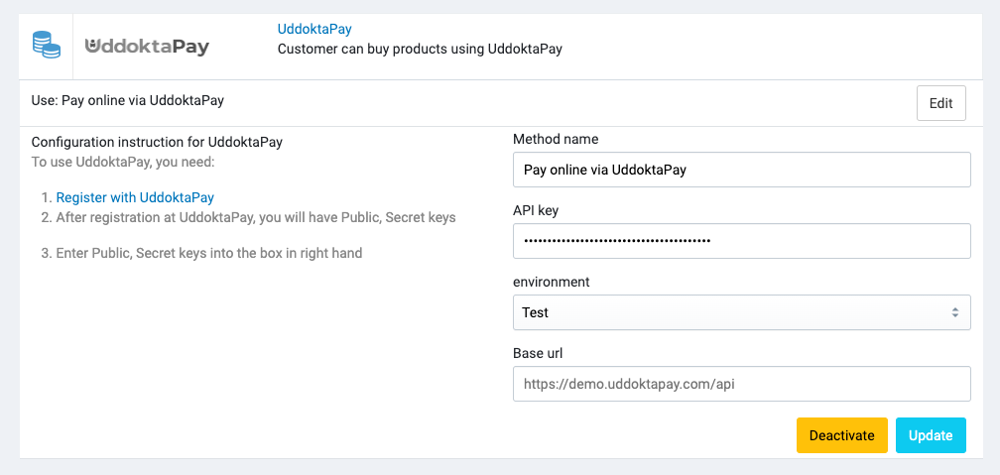

# Uddoktapay

[UddoktaPay](https://uddoktapay.com) is an amazing payment gateway where we can transfer money on our own personal number and which is fully automatic.

## Setup

### Get API Credentials

To get API credentials, you need to contact UddoktaPay support team at https://uddoktapay.com/contact.html.

### Configure UddoktaPay in Admin

After you get API credentials, in your store's Admin, go to **Payments** -> **Payment Methods**, click to **Settings** of the UddoktaPay payment method,

