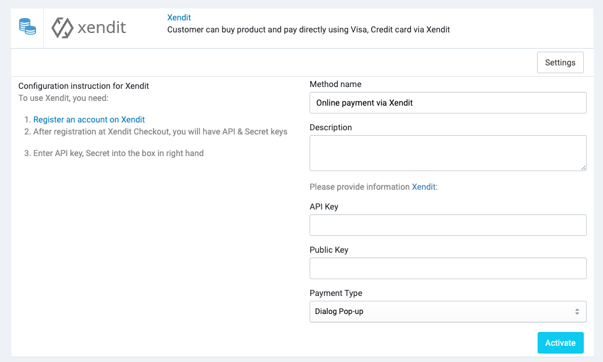

# Xendit

[Xendit](https://www.xendit.co) is a payment gateway that helps businesses make payments simple, secure and easy for
customers.

## Create a Xendit account

1. Create a Xendit account at [https://dashboard.xendit.co/register](https://dashboard.xendit.co/register)

2. Go to [https://dashboard.xendit.co/settings/developers](https://dashboard.xendit.co/settings/developers) and copy
   the `Secret Key` and `Public Key` to the Xendit settings page in the Sellacious backend.

## Configure Xendit in Admin

In your store's Admin, go to **Payments** -> **Payment Methods**, click to **Settings** of the Xebndit payment method,
and it will open the configuration section.

## Supported Currencies

### If you are not using your own acquirer Merchant ID

🇮🇩 Indonesian Merchants
   - Indonesian Rupiah (IDR)

🇵🇭 Philippines Merchants
- Philippines Peso (PHP)
- United States Dollar (USD)

### If you have your own acquirer Merchant ID

- Indonesian Rupiah (IDR)
- Philippines Peso (PHP)
- United States Dollar (USD)
- Singapore Dollar (SGD)
- Malaysian Ringgit (MYR)

## Test Cards

Before accepting real payment, you can use testing cards in this section to test the payment flow.

| Schema | Card Number | 3DS Case | Charge | Expected Behavior |
| ------ | ----------- | -------- | ------ | ----------------- |
| VISA   | 4000000000001091 | 3DS EMV 2.0 Challenge | ✅ | Card is enrolled in 3DS EMV 2.0 and will trigger challenge flow. Popup page will be generated and OTP will be requested. |
| Mastercard | 5200000000001096 | 3DS EMV 2.0 Challenge | ✅ | Card is enrolled in 3DS EMV 2.0 and will trigger challenge flow. Popup page will be generated and OTP will be requested. |
| JCB | 3337000000200004 | 3DS EMV 2.0 Challenge | ✅ | Card is enrolled in 3DS EMV 2.0 and will trigger challenge flow. Popup page will be generated and OTP will be requested. |
| AMEX | 340000000001098 | 3DS EMV 2.0 Challenge | ✅ | Card is enrolled in 3DS EMV 2.0. The OTP page will be generated, without rendering and with auto success.*Simulated in test mode.*Note: this is for testing in development only. AMEX cards are only usable with certain acquirers. In Indonesia, you must have your own Merchant ID with BCA to accept AMEX cards. |
| VISA | 4000000000001000 | 3DS EMV 2.0 Frictionless | ✅ | Card is enrolled in 3DS EMV 2.0 and will trigger frictionless flow. Popup page will be generated but 3DS will complete without requiring OTP. |
| Mastercard | 5200000000001005 | 3DS EMV 2.0 Frictionless | ✅ | Card is enrolled in 3DS EMV 2.0 and will trigger frictionless flow. Popup page will be generated but 3DS will complete without requiring OTP. |
| Mastercard | 4000000000000010 | 3DS Enabled | ✅ only success if skip 3DS | Card is enrolled in 3DS and can be used to test the authentication flow but will fail the authentication |
| Mastercard | 5200000000000015 | 3DS Enabled | ✅ only success if skip 3DS | Card is enrolled in 3DS and can be used to test the authentication flow but will fail the authentication |
| AMEX | 340000000006022 | 3DS Enabled | ✅ only success if skip 3DS | Card is enrolled in 3DS and can be used to test the authentication flow but will fail the authentication. Note: this is for testing in development only. AMEX cards are only usable with certain acquirers. In Indonesia, you must have your own Merchant ID with BCA to accept AMEX cards. |
| VISA | 4000000000001075 | 3DS Enabled | ✅ only success if skip 3DS | Card is enrolled in 3DS but will fail due to timeout during the 3DS request. Useful for handling 3DS timeouts in your system. |
