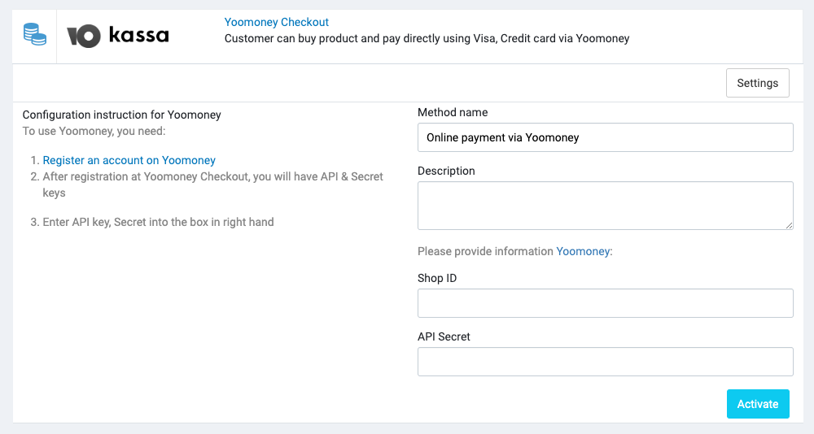

# YooMoney

[YooMoney](https://yoomoney.ru/) is a payment service provider in Russia. It allows you to accept payments from bank
cards, e-wallets, mobile phones, and cash via payment kiosks.

## Setup

### 1. Create a YooMoney account

Create a YooMoney account at https://yoomoney.ru.

After registration at Yoomoney Checkout, you will have API & Secret keys.

## Configuration in Admin

In your store's Admin, go to **Payments** -> **Payment Methods**, click to **Settings** of the Coinbase payment method,
and it will open the configuration section.

## Video tutorial

<iframe width="560" height="315" src="https://www.youtube.com/embed/wfj1ehVSrI0" title="YouTube video player" frameborder="0" allow="accelerometer; autoplay; clipboard-write; encrypted-media; gyroscope; picture-in-picture; web-share" allowfullscreen></iframe>

## Supported currencies

- Dollar USD
- Euro EUR
- Belarusian ruble BYN
- Tenge KZT
- Pound sterling GBP
- Renminbi CNY
- Swiss franc CHF
- Czech koruna CZK
- Polish zloty PLN
- Japanese yen JPY

## Test Cards

| Card number      | Card type        | Status |
|------------------|------------------|--------|
| 5555555555554477 | Mastercard       | ✔️     |
| 5555555555554444 | Mastercard       | ➖      |
| 6759649826438453 | Maestro          | ➖      |
| 4793128161644804 | Visa             | ✔️     |
| 4111111111111111 | Visa             | ➖      |
| 4175001000000017 | Visa Electron    | ➖      |
| 2200000000000004 | Mir              | ✔️     |
| 2202474301322987 | Mir              | ➖      |
| 370000000000002  | American Express | ➖      |
| 3528000700000000 | JCB              | ➖      |
| 36700102000000   | Diners Club      | ➖      |

You can find more test
cards [here](https://yookassa.ru/developers/payment-acceptance/testing-and-going-live/testing#test-bank-card).
