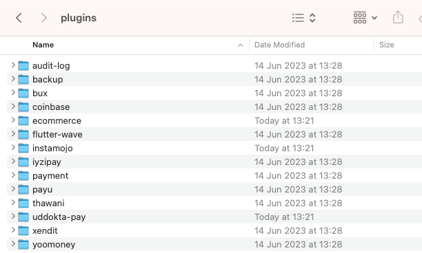
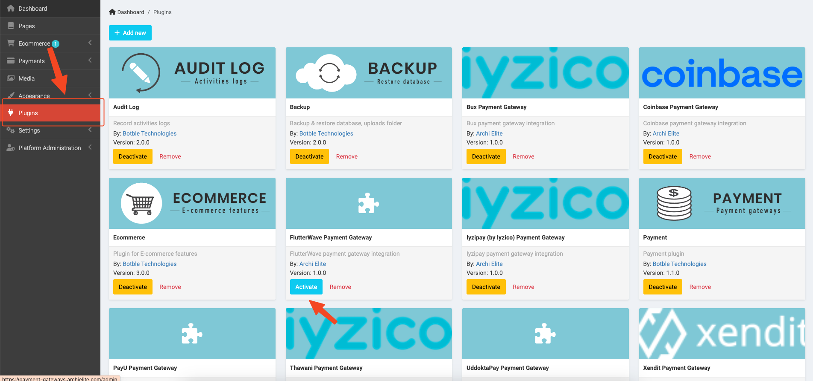

# Installation

## Installing

To install the plugin, for the eCommerce version of Botble CMS, you can follow these steps below:

Download our plugins from your [CodeCanyon](https://codecanyon.net/downloads) account, then extract it and copy all
payment folders into `platform/plugins` folder of your site.

Go to **Admin** -> **Plugins** then activate the plugins you need.

## Next steps

After you have installed the plugin, you can start setting up your payment credentials and other settings. Please refer to
the **Payment Gateways** section for more details.